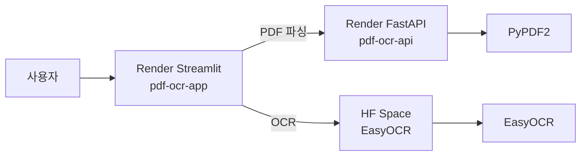

# PDF 파싱 & 이미지 OCR 웹앱

Python 8주차 실습 프로젝트. **FastAPI + Streamlit**으로 PDF 파싱과 EasyOCR 이미지 OCR을 제공하며, 클라우드 배포는 **Render**(PDF)와 **Hugging Face Spaces**(OCR)를 조합해 운영합니다.

## 배포 URL

| 서비스 | 플랫폼 | URL |
|--------|--------|-----|
| Streamlit 웹앱 | Render | https://pdf-ocr-app-f189.onrender.com |
| FastAPI (PDF) | Render | https://pdf-ocr-api-bl6u.onrender.com |
| OCR (EasyOCR) | Hugging Face | https://huggingface.co/spaces/kangjinmo/easyocr-ko-en |

GitHub 저장소: https://github.com/jinmo78/pdf-ocr-webapp

---

## 아키텍처



- **PDF 파싱**: Render Streamlit → Render FastAPI → PyPDF2
- **이미지 OCR**: Render Streamlit → Hugging Face Space (gradio_client)
- Render 무료 플랜(512MB)에서는 EasyOCR 빌드/실행이 어려워 OCR은 HF Space로 분리

---

## 프로젝트 구조

```
답안파일/
├── fastapi_app.py          # FastAPI 백엔드 (PDF + OCR API)
├── streamlit_app.py        # Streamlit 프론트엔드
├── receipt_parser.py       # 영수증 상품명·금액 추출 파서
├── requirements.txt        # 로컬 개발용 (전체 패키지)
├── requirements-api.txt    # Render FastAPI 전용
├── requirements-app.txt    # Render Streamlit 전용
├── render.yaml             # Render Blueprint 설정
├── deploy.ps1 / deploy.bat # GitHub 배포 스크립트
├── hf-ocr/                 # Hugging Face Space OCR 앱
│   ├── app.py
│   ├── receipt_parser.py
│   ├── requirements.txt
│   └── README.md
└── .github/workflows/
    └── sync-hf-space.yml   # HF Space 자동 동기화 (선택)
```

---

## 로컬 실행

### 1. 패키지 설치

```powershell
cd "C:\Users\ilove\OneDrive\Python_test\8주차\project\답안파일"
pip install -r requirements.txt
```

### 2. 터미널 2개 실행

**터미널 1 — FastAPI**

```powershell
python fastapi_app.py
```

- URL: http://localhost:8002

**터미널 2 — Streamlit**

```powershell
streamlit run streamlit_app.py
```

- URL: http://localhost:8501

### 3. 기능

- **PDF 파싱**: PDF 업로드 → 「PDF 파싱 시작」
- **이미지 OCR**: 이미지 업로드 → 「이미지 OCR 시작」
- **영수증 모드**: 「영수증에서 상품명·금액만 추출」 체크 후 OCR

---

## Render 배포

### Blueprint 구성 (`render.yaml`)

| 서비스 | 역할 | requirements |
|--------|------|--------------|
| `pdf-ocr-api` | FastAPI PDF API | `requirements-api.txt` |
| `pdf-ocr-app` | Streamlit UI | `requirements-app.txt` |

### Environment Variables (`pdf-ocr-app`)

| Key | Value |
|-----|-------|
| `FASTAPI_URL` | `https://pdf-ocr-api-bl6u.onrender.com` |
| `HF_OCR_URL` | `https://huggingface.co/spaces/kangjinmo/easyocr-ko-en` |

### 배포 절차

1. GitHub push

```powershell
git push origin main
```

2. Render Dashboard → Blueprints → `pdf-ocr-webapp` → **Manual sync**
3. 또는 각 서비스에서 **Manual Deploy**

### Render 배포 시 겪은 문제와 해결

| 문제 | 원인 | 해결 |
|------|------|------|
| Build error (EasyOCR) | PyTorch/EasyOCR 용량·메모리 초과 | API에서 EasyOCR 제거, PDF 전용 배포 |
| `ModuleNotFoundError: numpy` | API requirements에 numpy 미포함 | numpy/PIL import를 OCR 함수 내부로 이동 |
| `Failed to resolve pdf-ocr-api-bl6u` | FASTAPI_URL에 `.onrender.com` 누락 | URL 정규화 + 전체 URL 명시 |
| OCR 503 on Render | 512MB RAM 부족 | HF Space 연동 (`gradio_client`) |

---

## Hugging Face Spaces 배포

### Space 정보

- **이름**: `kangjinmo/easyocr-ko-en`
- **SDK**: Gradio 5.20
- **Hardware**: CPU basic (16GB RAM, 무료)

### 배포 방법 (파일 업로드)

Space **Files** 탭에서 `hf-ocr/` 폴더 파일 업로드:

- `app.py`
- `receipt_parser.py`
- `requirements.txt`
- `README.md`

### HF Spaces 배포 시 겪은 문제와 해결

| 문제 | 원인 | 해결 |
|------|------|------|
| Streamlit SDK 없음 | HF가 Streamlit 기본 SDK 폐지 | Gradio SDK 사용 |
| `HfFolder` ImportError | Gradio 4.x + 최신 huggingface_hub 충돌 | Gradio 5.20 + pydantic==2.10.6 |
| `ssr` TypeError | Gradio 5.20 미지원 옵션 | `demo.launch()` 단순화 |
| numpy ABI 오류 | opencv + numpy 2.x 충돌 | numpy==1.26.4, opencv==4.10.0.84 고정 |
| CUDA torch 설치 | easyocr이 GPU torch 끌어옴 | CPU torch index URL 사용 |

---

## Render ↔ Hugging Face OCR 연동

Render Streamlit에서 `HF_OCR_URL`이 설정되면 OCR 요청을 **FastAPI 대신 HF Space**로 보냅니다.

```python
# streamlit_app.py
from gradio_client import Client, handle_file

client = Client("kangjinmo/easyocr-ko-en")
full_text, details, receipt_text = client.predict(
    handle_file(image_path),
    receipt_mode,
    api_name="/predict",
)
```

- PDF는 Render FastAPI 사용
- OCR은 HF Space 사용
- 첫 OCR 요청 시 HF Space 슬립 해제로 1~2분 소요 가능

---

## 영수증 상품명·금액 추출

`receipt_parser.py`가 OCR 좌표 기반으로 영수증에서 상품명과 금액만 추출합니다.

### 동작 원리

1. EasyOCR `readtext()` → 텍스트 + bbox 좌표
2. y좌표 기준으로 같은 줄 그룹화
3. 줄 끝 숫자 → 금액, 나머지 → 상품명
4. `편의점`, `합계`, `카드` 등 헤더/푸터 제외

### 사용

- **로컬 / Render Streamlit**: 「영수증에서 상품명·금액만 추출」 체크
- **HF Space**: 「영수증에서 상품명·금액만 추출」 체크박스

### 예시 출력

| 상품명 | 금액 |
|--------|------|
| 라라스윗) 바닐라파인트474 | 6,900 |
| 라라스윗) 초코파인트474ml | 6,900 |

---

## GitHub 연동

```powershell
git remote -v
# origin  https://github.com/jinmo78/pdf-ocr-webapp.git

git add .
git commit -m "메시지"
git push origin main
```

### GitHub Actions (선택)

`.github/workflows/sync-hf-space.yml` — push 시 `hf-ocr/` 폴더를 HF Space에 자동 업로드.

필요 Secret: `HF_TOKEN` (Hugging Face Write 토큰)

---

## 주요 파일 설명

### `fastapi_app.py`

- `GET /` — 헬스체크
- `POST /parse-pdf` — PyPDF2 PDF 텍스트 추출
- `POST /ocr-image` — EasyOCR 이미지 OCR (로컬 전용, Render PDF-only API에서는 503)

### `streamlit_app.py`

- PDF 업로드 → FastAPI `/parse-pdf` 호출
- 이미지 업로드 → HF Space 또는 FastAPI `/ocr-image` 호출
- `FASTAPI_URL`, `HF_OCR_URL` 환경 변수 지원

### `receipt_parser.py`

- `parse_receipt_items(detections)` — OCR 결과에서 상품명·금액 리스트 추출
- `format_receipt_items(items)` — Markdown 테이블 형식 출력

---

## 트러블슈팅

### Streamlit `use_container_width` 오류

Streamlit 1.39.0에서 `st.image()`는 `use_column_width=True` 사용.

### PowerShell `deploy.ps1` 실행 거부

```powershell
powershell -ExecutionPolicy Bypass -File .\deploy.ps1
```

### Render 무료 플랜 슬립

15분 미사용 시 서비스 중지 → 첫 접속 30초~1분 대기.

### HF Space 슬립

미사용 시 Space 중지 → 첫 OCR 1~2분 대기.

---

## 기술 스택

| 구분 | 기술 |
|------|------|
| Backend | FastAPI, Uvicorn, PyPDF2 |
| Frontend | Streamlit |
| OCR | EasyOCR (한국어·영어) |
| 배포 | Render, Hugging Face Spaces |
| OCR 연동 | gradio-client |
| 버전 관리 | Git, GitHub |

---

## 작업 이력 요약

1. 로컬 FastAPI + Streamlit 실습 환경 구성
2. Render Blueprint 배포 시도 (EasyOCR 빌드 실패 → PDF-only API로 전환)
3. Hugging Face Spaces Gradio OCR 앱 구축 (Streamlit SDK 폐지 대응)
4. Render Streamlit ↔ HF Space OCR 연동 (`gradio_client`)
5. 영수증 상품명·금액 추출 파서 추가
6. FASTAPI_URL, numpy/pydantic 등 배포 이슈 해결

---

## 라이선스

Apache 2.0 (HF Space 기준)
